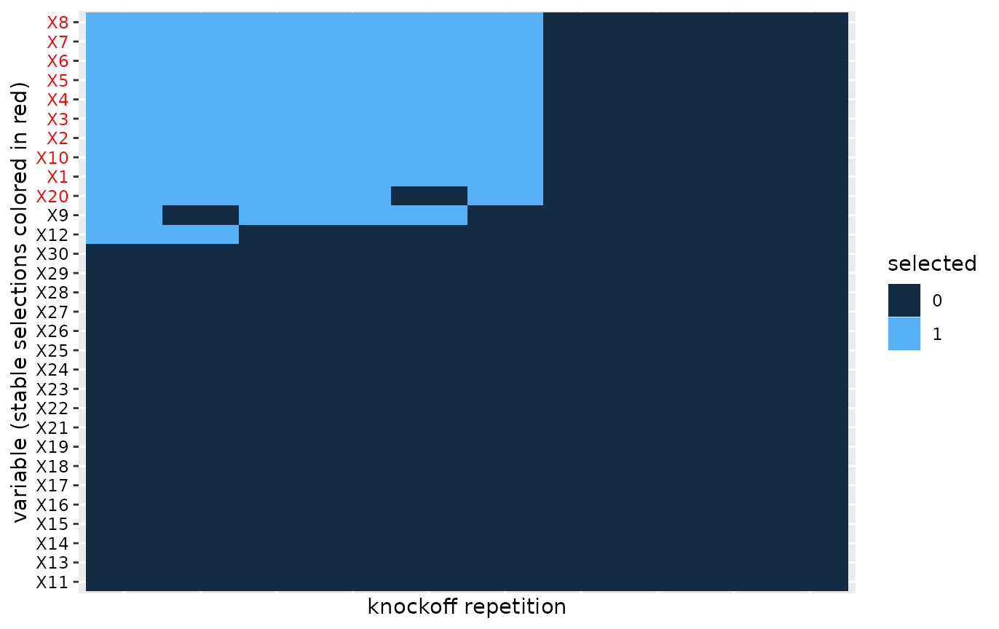

# The knockofftools package

## Introduction

In this vignette we demonstrate the main functionalities of the
knockofftools package. In particular, we demonstrate functions for
generating data sets, simulating knockoffs (MX and sequential), applying
the multiple knockoff filter for variable selection and visualizing
selections.

Let’s first recall how the knockoff variable selection methodology works
in a nutshell:

1.  Simulate a knockoff copy $`\tilde{X}`$ of the original covariates
    data $`X`$.
2.  Compute feature statistics $`W_j=|\beta_j|-|\tilde{\beta}_j|`$ from
    an aggregated regression of $`Y`$ on $`X`$ and $`\tilde{X}`$. Large,
    positive statistics $`W_j`$ indicate association of $`X_j`$ with
    $`Y`$.
3.  For FDR control use the *knockoffs$`+`$* procedure to select
    variables $`j`$ that fulfill $`W_j \geq \tau_+`$ where
    ``` math
    \tau_+ = \underset{t>0}{\operatorname{argmin}} \left\{\frac{1 + |\{j : W_j \leq t\}|}{|\{j : W_j \leq t\}|} \leq q\right\}.
    ```
    This workflow selects variables associated with response with
    guaranteed control of false discovery rate $`FDR \leq q`$.

``` r

library(knockofftools)
```

## Data generation

In this section we will simulate a toy data set with a known truth. In
particular, we will simulate a set of covariates $`X`$ and a response
$`y`$ that is associated with some of the $`X`$’s through a regression
model.

*Simulation of $`X`$:* The `generate_X` function simulates the rows of
an $`n \times p`$ data frame $`X`$ independently from a multivariate
Gaussian distribution with mean $`0`$ and $`p \times p`$ covariance
matrix
``` math
\Sigma_{ij} = \left \{
\begin{array}{lr}
1\{i = j\}, & \text{Independent,} \\
\rho^{1\{i \neq j\}}, & \text{Equicorrelated,} \\
\rho^{|i-j|}, & \text{AR1},
\end{array}
\right.
```
where $`p_b`$ randomly selected columns are then dichotomized with the
indicator function $`\delta(x)=1(x > 0)`$.

``` r

# Generate a 2000 x 30 Gaussian data.frame under equi-correlation(rho=0.5) structure, 
# with 10 of the columns dichotomized
set.seed(1)
X <- generate_X(n=2000, p=30, p_b=10, cov_type = "cov_equi", rho=0.5)
```

The covariance type is specified with the parameter `cov_type` and the
correlation coefficient with `rho`. Each column of the resulting
data.frame is either of class `"numeric"` (for the continuous columns)
or `"factor"` (for the binary columns).

*Simulation of $`y|X`$:* The `generate_y` function simulates a response
$`y`$ from the (sparse) regression model
``` math
y = X \beta + \varepsilon, \textrm{ where } \varepsilon \sim N(0,I_n),
```
where the first `p_nn` regression coefficients are non-zero, all other
are set to zero. The (common) amplitude of the non-zero regression
coefficients is specified with `a`. Here we generate $`y`$ that is
associated with the first 10 covariates, each with amplitude $`a=0.1`$.

``` r

# Generate y ~ N(X%*%beta,I_n) where first 10 beta-coefficients are = a, all other = 0.
y <- generate_y(X = X, p_nn=10, a=0.1)
```

Note that inside `generate_y` the model.matrix of `X` is first scaled.

## Knockoff generation

*Sequential knockoffs:* The function `knockoff` receives as input a
data.frame (or tibble) `X` whose columns are either of class `"numeric"`
(for the continuous columns) or `"factor"` (for the categorical
columns). This is a common format of data involving both continuous and
categorical predictors. The output is a data.frame (or tibble)
corresponding to the knockoff copy of `X`:

``` r

# Simulate sequential knockoff of X:
Xk <- knockoff(X)
```

The above function will by default sample sequential knockoffs
(method=“seq”) based on LASSO regression (see ([Kormaksson et al.
2021](#ref-seqknockoffpaper))). Behind the scenes, `knockoff` calls the
function
[`glmnet::cv.glmnet`](https://glmnet.stanford.edu/reference/cv.glmnet.html)
sequentially.

*MX-knockoffs:* We can also simulate Gaussian MX-knockoffs (via call to
[`knockoff::create.second_order`](https://rdrr.io/pkg/knockoff/man/create.second_order.html)).
This function only works on data frames with all “numeric” columns.

``` r

# Generate a 2000 x 30 Gaussian data.frame under equi-correlation(rho=0.5) structure, 
X <- generate_X(n=2000, p=30, p_b=0, cov_type = "cov_equi", rho=0.5)
# Simulate second order multivariate Gaussian MX knockoff:
Xk <- knockoff(X, method="mx")
```

Note that in practice the user does not really need to call the
`knockoff` function directly, as the two main functions
`knockoff.statistics` and `variable.selections` implement the full
knockoff filter workflow. These will now be discussed below.

## Knockoff (feature) statistics

The function `knockoff.statistics` takes as main input `y`, `X`, and
`type` (defaults to `type="regression"`) and then proceeds to 1)
simulate independently `M` knockoffs $`\tilde{X}_k`$, $`k=1,\dots,M`$,
2) fit an aggregated regression model:
``` math
\begin{align}
Y = X \beta^{(k)} + \tilde{X}_k \tilde{\beta}^{(k)} + \varepsilon,
\end{align}
```
for each of the $`k=1,\dots,M`$ knockoff copies. Then finally calculate
(for each knockoff $`k`$) the corresponding knockoff (feature)
statistics $`W^{(k)}_j = |\beta_j^{(k)}|-|\tilde{\beta}_j^{(k)}|`$. By
changing the `M` parameter of `knockoff.statistics` we can calculate
multiple knockoff statistics in parallel:

``` r

set.seed(123)
X <- generate_X(n=2000, p=30, p_b=0, cov_type = "cov_ar1", rho=0.5)
y <- generate_y(X = X, p_nn=10, 0.1)
W <- knockoff.statistics(y, X, M=10)
```

The output `W` is a data.frame of knockoff statistics across the `M`
knockoff replicates.

Since the `knockoff.statistics` may take long to run for a single
knockoff copy, in particular with sequential knockoffs
(knockoffs.method=“seq”), we use parallel computing via the package
`clustermq` by default. Note that the user can specify a
cluster.scheduler that is system dependent. On our HPC we utilize the
LSF job scheduler, but other options (including local parallelization)
are outlined here: [User Guide -
clustermq](https://cran.r-project.org/web/packages/clustermq/vignettes/userguide.html)

## Variable selection based on multiple knockoff statistics

To calculate which variables will be selected for each of these knockoff
statistics we use the `variable.selections` function. This function
takes the knockoff statistics `W` as input and additionally specifies
the `error.type="fdr"` (default), `"pfer"` (per family error error), or
`"kfwer"` (k-familywise error rate) and the corresponding nominal error
level.

``` r

S = variable.selections(W, level = 0.1, error.type="fdr")
head(S$selected)
#>    S1 S2 S3 S4 S5 S6 S7 S8 S9 S10
#> X1  1  1  0  0  1  0  1  1  1   0
#> X2  1  1  0  0  1  0  1  1  1   0
#> X3  1  1  0  0  1  0  1  1  1   0
#> X4  1  1  0  0  1  0  1  1  1   0
#> X5  1  1  0  0  1  0  1  1  1   0
#> X6  1  1  0  0  1  0  1  1  1   0
S$stable.variables
#>  [1] "X1"  "X2"  "X3"  "X4"  "X5"  "X6"  "X7"  "X8"  "X10" "X20"
```

In a nutshell the function will both calculate individual variable
selections (for each knockoff replicate), but also a stable set of
variables that are selected most frequently among the replicates. For
FDR-control the stable variables are calculated using the heuristics in
[The multiple knockoffs filter
procedure](#multiple-knockoffs-filter-procedure), while for the other
two error types (`"pfer"` and `"kfwer"`) we simply choose all variables
selected more than `thres*M` times, where `thres` is an optional
parameter of the `variable.selections` function (`thres=0.5` by
default).

## Heatmap of multiple variable selections

In order to evaluate the robustness of the knockoff selection procedure
we can visualize a heatmap of the selections across the knockoff
replicates.

``` r

plot(S)
```

 We apply
co-clustering of the rows and columns of the heatmap and then order the
blocks according to increasing mean number of selections. This helps
with aesthetics, but also helps visualize the most important variables
that should tend towards the top of the heatmap.

## Appendix

### A. The multiple knockoffs filter procedure for FDR-control

([Kormaksson et al. 2021](#ref-seqknockoffpaper)) introduced a heuristic
algorithm for selecting stable variables from multiple independent
knockoff variable selections.

Let $`\tilde{X}_1, \dots, \tilde{X}_B`$ denote $`B`$ independent
knockoff copies of $`X`$. For each knockoff copy $`b`$ run the knockoff
filter and select the set of influential variables,
$`S_b \subseteq \{1,\dots,p\}`$. We propose the following heuristics to
select a final set of variables:

- Let $`F(r) \subseteq \{1,\dots,p\}`$, where $`r \in [0.5, 1]`$, denote
  the set of variables selected more than $`r \cdot B`$ times out of the
  $`B`$ knockoff draws.
- Let \$S(r)=\underset{b}{\rm mode}\\F(r) \cap S_b\\\$ denote the set of
  selected variables that appears most frequently, after filtering out
  variables that are not in $`F(r)`$.
- Return $`\hat{S} = S(\hat{r})`$, where
  $`\hat{r} = \underset{r \geq 0.5}{\operatorname{argmax}} |{S(r)}|`$,
  i.e. the largest set among $`\{S(r):r \geq 0.5\}`$.

The first step above essentially filters out variables that don’t appear
more than $`(100\cdot r)\%`$ of the time, which would seem like a
reasonable requirement in practice (e.g. with $`r=0.5`$). The second
step above then filters the $`B`$ knockoff selections $`S_b`$
accordingly and searches for the most frequent variable set among those.
The third step then establishes the final selection, namely the most
liberal variable selection among the sets $`\{S(r):r \geq 0.5\}`$.

## References

Kormaksson, M., L. J. Kelly, X. Zhu, S. Haemmerle, L. Pricop, and D.
Ohlssen. 2021. “Sequential Knockoffs for Continuous and Categorical
Predictors: With Application to a Large Psoriatic Arthritis Clinical
Trial Pool.” *Statistics in Medicine*.
