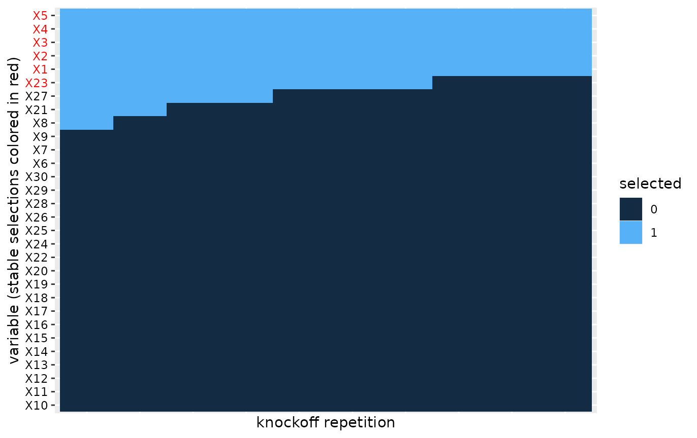

# Survival analysis with knockoffs

## Introduction

In this vignette we demonstrate how to do knockoff variable selection in
the context of censored time-to-event data. We consider the following
Cox regression model for knockoff variable selection for time-to-event
data:

``` math
\begin{align}
\lambda(t) = \lambda_0(t) \exp \left(X \beta + \tilde{X} \tilde{\beta} \right),
\end{align}
```

where $`\lambda(t)`$ is the hazard function corresponding to a censored
time-to-event response $`T`$ and $`\lambda_0(t)`$ is the baseline
hazard. The matrix $`X`$ is the design matrix corresponding to the
covariates of interest, while $`\tilde{X}`$ represents a knockoff copy
of $`X`$.

Knockoff variable selection in Cox regression involves the following
steps:

1.  Simulate a knockoff copy $`\tilde{X}`$ of the original covariates
    data $`X`$.
2.  Compute feature statistics $`W_j=|\beta_j|-|\tilde{\beta}_j|`$ from
    the aggregated Cox regression with covariates $`X`$ and
    $`\tilde{X}`$. Large, positive statistics $`W_j`$ indicate effect of
    $`X_j`$ on hazard rate.
3.  For FDR control use the *knockoffs$`+`$* procedure to select
    variables $`j`$ that fulfill $`W_j \geq \tau_+`$ where
    ``` math
    \tau_+ = \underset{t>0}{\operatorname{argmin}} \left\{\frac{1 + |\{j : W_j \leq t\}|}{|\{j : W_j \leq t\}|} \leq q\right\}.
    ```
    This workflow selects variables associated with response with
    guaranteed control of false discovery rate $`FDR \leq q`$.

``` r

library(knockofftools)
```

## Data generation

In this section we will simulate a toy data set with a known truth. In
particular, we will simulate a set of covariates $`X`$ and survival
times under censoring that are associated with some of the $`X`$’s
through a Cox regression model.

*Simulation of $`X`$:* The `generate_X` function simulates the rows of
an $`n \times p`$ data frame $`X`$ independently from a multivariate
Gaussian distribution with mean $`0`$ and $`p \times p`$ covariance
matrix
``` math
\Sigma_{ij} = \left \{
\begin{array}{lr}
1\{i = j\}, & \text{Independent,} \\
\rho^{1\{i \neq j\}}, & \text{Equicorrelated,} \\
\rho^{|i-j|}, & \text{AR1},
\end{array}
\right.
```
where $`p_b`$ randomly selected columns are then dichotomized with the
indicator function $`\delta(x)=1(x > 0)`$.

``` r

# Generate a 2000 x 30 Gaussian data.frame under equi-correlation(rho=0.5) structure, 
# with 10 of the columns  dichotomized
set.seed(1)
X <- generate_X(n=2000, p=30, p_b=10, cov_type = "cov_equi", rho=0.5)
```

The covariance type is specified with the parameter `cov_type` and the
correlation coefficient with `rho`. Each column of the resulting
data.frame is either of class `"numeric"` (for the continuous columns)
or `"factor"` (for the binary columns).

*Simulation of event and censoring times:* The function `simulWeib`
simulates survival times $`T`$ from a Cox regression model

``` math
\lambda(t) = \lambda_0(t) \exp \left(X \beta \right),
```
with Weibull baseline hazard:
``` math
\lambda_0(t) = \lambda_0 \rho t^{\rho-1}
```
where $`\lambda_0 > 0`$ and $`\rho > 0`$ are scale and shape parameters,
respectively. The censoring times $`C`$ are randomly drawn from an
exponential distribution with a small (fixed) rate $`\lambda_C=0.0005`$,
which results in very mild censoring. Once $`T`$ and $`C`$ have been
simulated the function sets `time = min(T, C)` and `event = 1{T < C}`:

``` r

simulWeib <- function(N, lambda0, rho, lp) {
    lambdaC = 5e-04
    v <- runif(n = N)
    Tlat <- (-log(v)/(lambda0 * exp(lp)))^(1/rho)
    C <- rexp(n = N, rate = lambdaC)
    time <- pmin(Tlat, C)
    status <- as.numeric(Tlat <= C)
    survival::Surv(time = time, event = status)
}
```

In this toy data set we assume that the first five covariates affect the
hazard $`\lambda(t)`$ through the linear predictor $`\ell_p=X\beta`$ and
then simulate the survival object:

``` r

lp <- generate_lp(X, p_nn=5, a=2)
set.seed(2)
y <- simulWeib(N=2000, lambda = 0.01, rho = 1, lp = lp)
```

## Knockoff (feature) statistics in Cox regression

Let’s now use the `knockoff.statistics` function to (a) simulate
independently $`M`$ knockoffs $`\tilde{X}_k`$, $`k=1,\dots,M`$, (b) fit
the aggregated Cox model to above data:
``` math
\begin{align}
\lambda(t) = \lambda_0(t) \exp \left(X \beta^{(k)} + \tilde{X}_k \tilde{\beta}^{(k)} \right),
\end{align}
```
for each of the $`k=1,\dots,M`$ knockoff copies. Then finally calculate
(for each knockoff $`k`$) the corresponding knockoff (feature)
statistics $`W^{(k)}_j = |\beta_j^{(k)}|-|\tilde{\beta}_j^{(k)}|`$.

``` r

set.seed(123)
W <- knockoff.statistics(y, X, type="survival", M=10)
head(W)
#>            W1           W2          W3          W4         W5           W6
#> X1 1.74385575  1.688399422  1.72585475  1.74029139  1.7234531  1.725687035
#> X2 1.82294465  1.762800761  1.77717388  1.82853736  1.8040355  1.848307333
#> X3 1.79006418  1.731865250  1.76590859  1.78565227  1.7681818  1.816228377
#> X4 1.76204064  1.691894366  1.72672748  1.73142901  1.7408079  1.777589645
#> X5 1.80203975  1.734332717  1.77405548  1.78675847  1.7793463  1.786158683
#> X6 0.01294729 -0.004468954 -0.01579702 -0.03514107 -0.0258282 -0.001140941
#>            W7         W8         W9        W10
#> X1 1.75022900 1.70711399 1.72540564 1.70512312
#> X2 1.80582574 1.77146158 1.81769534 1.78099929
#> X3 1.76818033 1.75156179 1.74726089 1.74963685
#> X4 1.73046674 1.72357287 1.75925751 1.72126777
#> X5 1.81131739 1.75966621 1.80142519 1.76013210
#> X6 0.01891569 0.01083217 0.01792927 0.01324787
```

The output is a data.frame whose columns are the $`M`$ knockoff
statistics. In the above we have used (as a default) parallel computing
via the package `clustermq` (see: [User Guide -
clustermq](https://cran.r-project.org/web/packages/clustermq/vignettes/userguide.html)).

## Variable selection via multiple knockoffs

We simulated $`M = 10`$ feature statistics in order to evaluate
robustness of the knockoff variable selection process, each time
simulating a new knockoff of `X`. To calculate which variables will be
selected for each of these knockoff statistics we use the
`variable.selections` function. This function takes the knockoff
statistics `W` as input and additionally specifies the
`error.type="fdr"` (default), `"pfer"` (per family error error), or
`"kfwer"` (k-familywise error rate) and the corresponding target error
level.

``` r

S = variable.selections(W, level = 0.2, error.type="fdr")
head(S$selected)
#>    S1 S2 S3 S4 S5 S6 S7 S8 S9 S10
#> X1  1  1  1  1  1  1  1  1  1   1
#> X2  1  1  1  1  1  1  1  1  1   1
#> X3  1  1  1  1  1  1  1  1  1   1
#> X4  1  1  1  1  1  1  1  1  1   1
#> X5  1  1  1  1  1  1  1  1  1   1
#> X6  0  0  0  0  0  0  0  0  0   0
S$stable.variables
#> [1] "X1"  "X2"  "X3"  "X4"  "X5"  "X23"
```

In a nutshell the function will both calculate individual variable
selections (for each knockoff replicate) and a stable set of variables
that are selected most frequently among the `M` replicates. For
FDR-control the stable variables are calculated using the heuristics in
[The multiple knockoffs filter
procedure](#multiple-knockoffs-filter-procedure), while for the other
two error types (`"pfer"` and `"kfwer"`) we simply choose all variables
selected more than `thres*M` times, where `thres` is an optional
parameter of the `variable.selections` function (`thres=0.5` by
default).

## Heatmap of multiple variable selections

In order to evaluate the robustness of the knockoff selection procedure
we can visualize a heatmap of the selections across the knockoff
replicates.

``` r

plot(S)
#> Warning: Vectorized input to `element_text()` is not officially supported.
#> ℹ Results may be unexpected or may change in future versions of ggplot2.
```


We apply co-clustering of the rows and columns of the heatmap, which
identifies blocks of similarities in the binary selections. We then
order the blocks according to increasing mean number of selections. This
helps with aesthetics, but also helps visualize the most important
variables that should tend towards the top of the heatmap.

## Appendix

### A. The multiple knockoffs filter procedure for FDR-control

([Kormaksson et al. 2021](#ref-seqknockoffpaper)) introduced a heuristic
algorithm for selecting stable variables from multiple independent
knockoff variable selections.

Let $`\tilde{X}_1, \dots, \tilde{X}_B`$ denote $`B`$ independent
knockoff copies of $`X`$. For each knockoff copy $`b`$ run the knockoff
filter and select the set of influential variables,
$`S_b \subseteq \{1,\dots,p\}`$. We propose the following heuristics to
select a final set of variables:

- Let $`F(r) \subseteq \{1,\dots,p\}`$, where $`r \in [0.5, 1]`$, denote
  the set of variables selected more than $`r \cdot B`$ times out of the
  $`B`$ knockoff draws.
- Let \$S(r)=\underset{b}{\rm mode}\\F(r) \cap S_b\\\$ denote the set of
  selected variables that appears most frequently, after filtering out
  variables that are not in $`F(r)`$.
- Return $`\hat{S} = S(\hat{r})`$, where
  $`\hat{r} = \underset{r \geq 0.5}{\operatorname{argmax}} |{S(r)}|`$,
  i.e. the largest set among $`\{S(r):r \geq 0.5\}`$.

The first step above essentially filters out variables that don’t appear
more than $`(100\cdot r)\%`$ of the time, which would seem like a
reasonable requirement in practice (e.g. with $`r=0.5`$). The second
step above then filters the $`B`$ knockoff selections $`S_b`$
accordingly and searches for the most frequent variable set among those.
The third step then establishes the final selection, namely the most
liberal variable selection among the sets $`\{S(r):r \geq 0.5\}`$.

## References

Kormaksson, M., L. J. Kelly, X. Zhu, S. Haemmerle, L. Pricop, and D.
Ohlssen. 2021. “Sequential Knockoffs for Continuous and Categorical
Predictors: With Application to a Large Psoriatic Arthritis Clinical
Trial Pool.” *Statistics in Medicine*.
